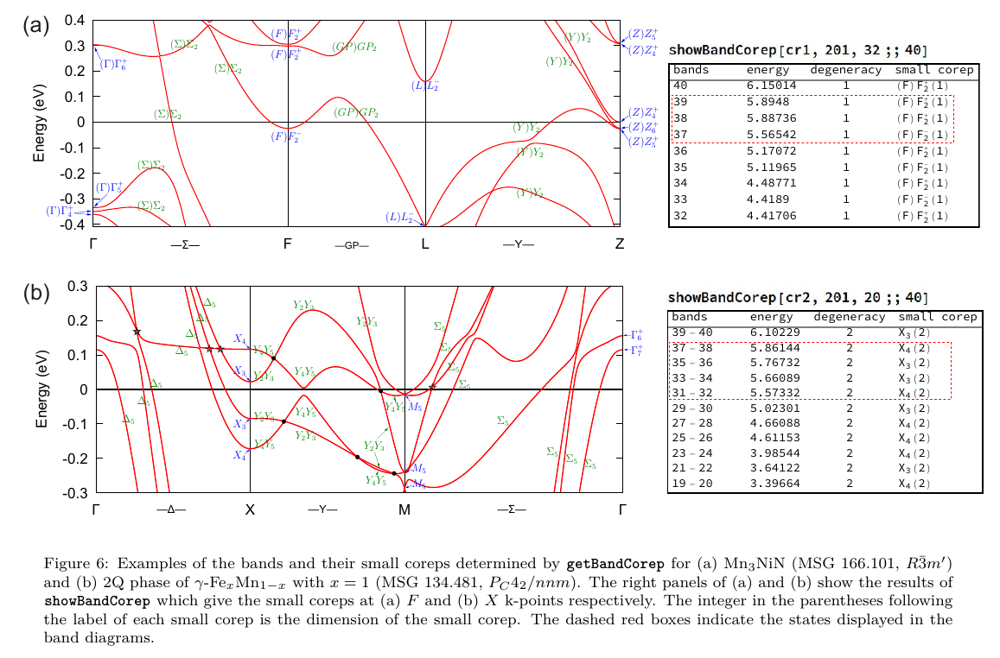
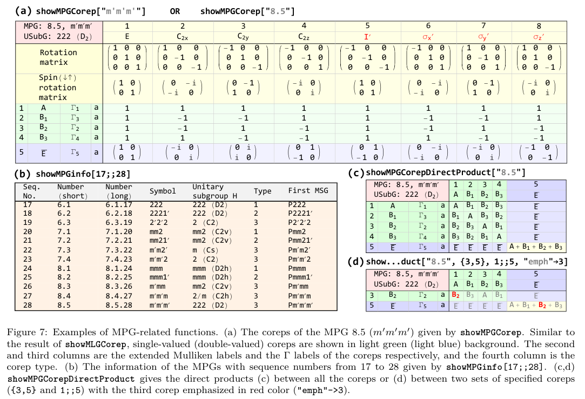

# MSGCorep
A mathematica package for irreducible corepresentations (coreps) of all the 1651 magnetic space group in three-dimensional space, using the BC convention. Here, "BC convention" means the convention used in the the famous book “The mathematical theory of symmetry in solids” by C. J. Bradley & A. P. Cracknell. This package is based on our previous package [**SpaceGroupIrep**](https://github.com/goodluck1982/SpaceGroupIrep).

## Communications
* Users can join WeChat group for communications: [the QR code](https://2h437cg9.kuaizhan.com/a/xobAfRbwGe/qrcode). If you cannot join the WeChat group, please contact me through gbliu(AT)bit(dot)edu(dot)cn.
* 点击上面链接加入 SpaceGroupIrep/MSGCorep 使用交流微信群，如无法加入可邮件联系。

## Please refer to the following papers for details of the code:
* [Comput. Phys. Commun. **288** , 108722 (2023)](https://doi.org/10.1016/j.cpc.2023.108722)   ([arXiv:2211.10740](https://arxiv.org/abs/2211.10740))
* [Comput. Phys. Commun. **265** , 107993 (2021)](https://doi.org/10.1016/j.cpc.2021.107993)   ([arXiv:2012.08871](http://arxiv.org/abs/2012.08871))

If you use this package in your research, please cite the above papers.

## Functionalities of MSGCorep
* Elements of any magnetic space group (MSG), magnetic little group (MLG), magnetic point group (MPG), and their double groups can be easily obtained. 
* Obtain and show the small coreps (MLG coreps) at any k-point for any MSG.
* Obtain and show the full coreps (MSG coreps) of any magnetic k-star for any MSG.
* Both single-valued and double-valued coreps are supported. 
* Calculate the decomposition of the direct product of full coreps for any two magnetic k-stars. 
* Determine the small coreps of Bloch states in energy bands. 
* Support all the 122 MPGs, including their coreps and direct product of coreps.

In a word, the package **MSGCorep** is an offline database and tool set for easy access to complete corep data of all 1651 MSGs and 122 MPGs, and it is very useful for both study and research.

## Files
* **MSGCorep.wl** The main file.
* **MSGData.wl** Contains the MSG data used by MSGCorep.wl.
* **Usage.wl** The usages for the functions in MSGCorep.
* **libMLGCorep.mx** This file contains the small corep data used by the `getBandCorep` function.
* **libMLGCorep.mx_RaspberryPi** On raspberry pi, use this file and rename it to libMLGCorep.mx. *Note that mathematica can be used **free of charge** on raspberry pi for non-commercial use, see [this page](https://www.wolfram.com/raspberry-pi/).*
* **examples/examples-in-the-paper.nb**  A simple demo file for the examples in the paper.
* **BC_MSG_elements/*.txt**  Use one of the files in this directory and rename it to `msg.txt` when using [MagVasp2trace](https://www.cryst.ehu.es/html/cryst/topological/Mvasp2trace.tar.gz).

## Dependence
**SpaceGroupIrep**  (https://github.com/goodluck1982/SpaceGroupIrep)

## Installation
Please install **SpaceGroupIrep** package first. Then place the directory **MSGCorep** containing at least the four files, i.e. MSGCorep.wl, MSGData.wl, Usage.wl, and libMLGCorep.mx, under any of the following paths:
* `$InstallationDirectory`/AddOns/Packages/
* `$InstallationDirectory`/AddOns/Applications/
* `$BaseDirectory`/Applications/
* `$UserBaseDirectory`/Applications/

where `$InstallationDirectory` is the installation directory of Mathematica (**version ≥ 11.2**), and `$BaseDirectory`
and `$UserBaseDirectory` are the directories containing respectively systemwide and user-specific files loaded
by Mathematica. The concrete values of `$InstallationDirectory`, `$BaseDirectory`, and `$UserBaseDirectory`
can be obtained by running them in Mathematica because they are all built-in symbols. 

Then one can use the package after running **```<<MSGCorep` ```** or **```<<"MSGCorep`"```**.

**Tips**: Use ```?MSGCorep`*``` to obtain a list of all public functions and vairables in the package. And similarly, you can also use ```?MSGCorep`*MLG*``` to obtain a list of all public functions and variables whose names contain "MLG".

## Exhibition
### 1. Show the list of MSGs specified by their family numbers
![showMSGSym[1;;5]](imgs/showMSGSym.png)

### 2. The small coreps of the P point of MSG 97.155
![showMLGCorep[{97,155},"P"]](imgs/MLGCorep-97.155-P.png)

### 3. The full coreps of the magnetic star <sup>\*</sup>X of MSG 79.27
![showMSGCorep[{79.27},"X"]](imgs/MSGCorep-79.27-X.png)

### 4. The direct product of full coreps between magnetic stars <sup>\*</sup>X and <sup>\*</sup>R for MSG 75.4
![showMSGCorepDirectProduct[{75, 4}, "X", "R"]](imgs/DirectProduct-75.4-X-R.png)

### 5. Determined small coreps for energy bands


### 6. MPG support

